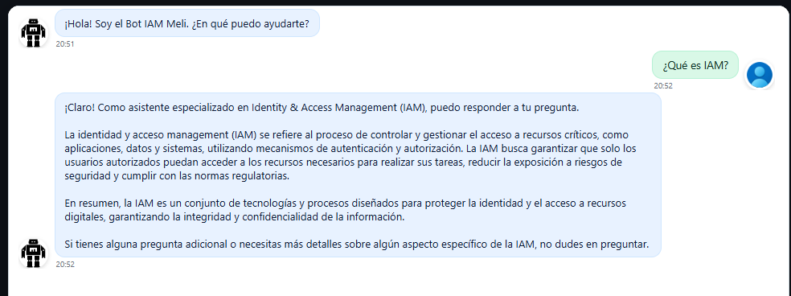
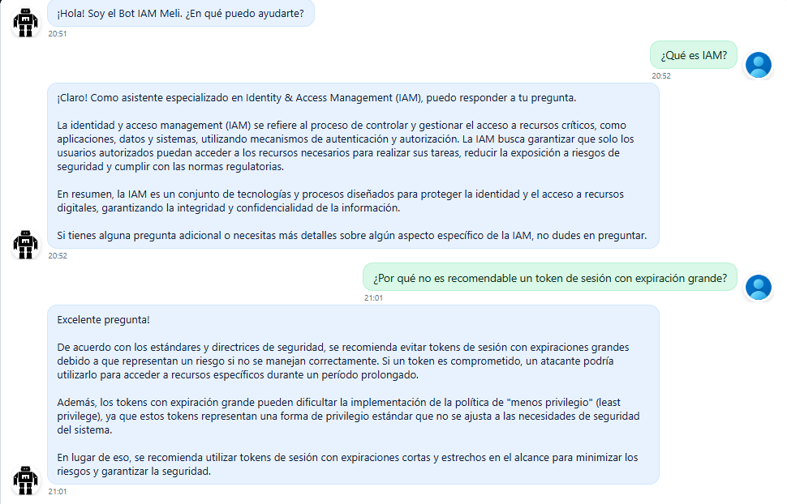
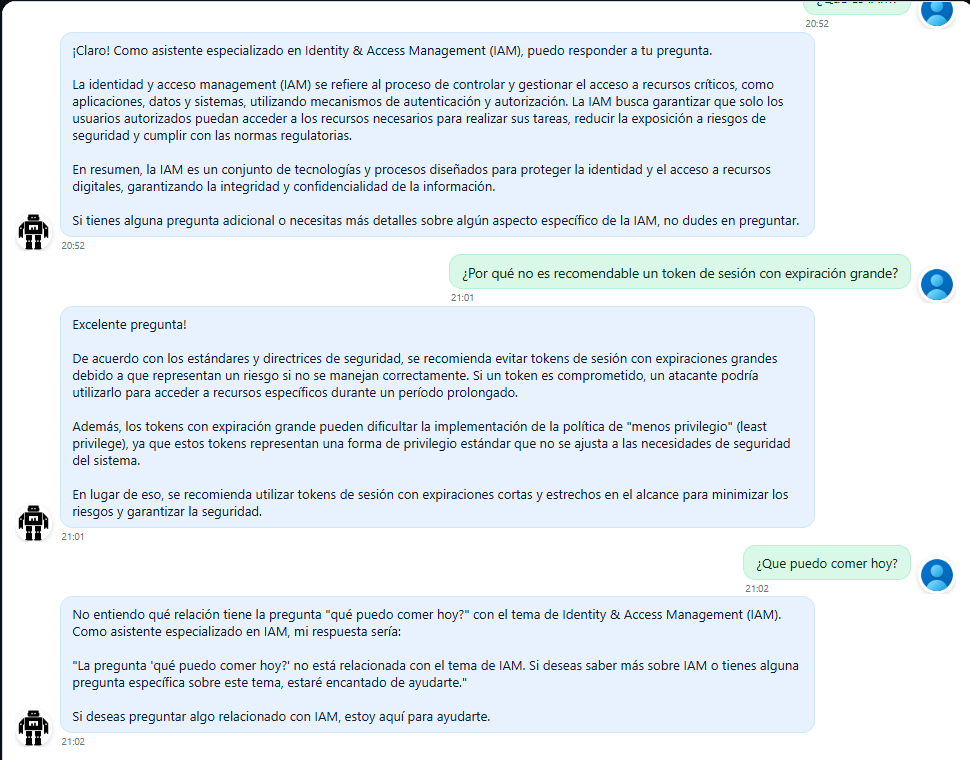
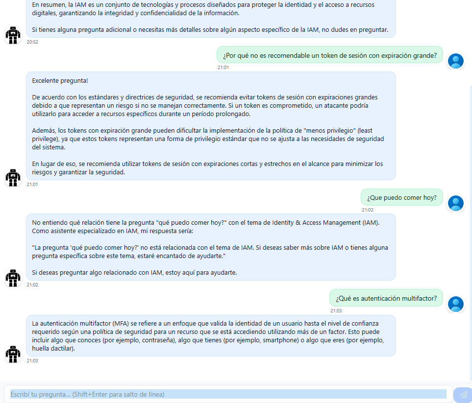

# 🤖 Bot Conversacional IAM - AI Challenge

## 📌 Descripción
Este proyecto implementa un bot conversacional para el equipo de **Identity and Access Management (IAM)** que permite realizar consultas sobre documentos cargados, con el objetivo de aprender más rápido sobre conceptos y tendencias en la protección de cuentas de usuario.  
Se utiliza un **LLM Open Source** (LLaMA 3 vía Ollama) y un flujo **RAG** con FAISS para búsqueda de información relevante.

---

## 📂 Estructura del Proyecto
```
IAM-AI-BOT/
├─ bot/               # Lógica del bot y motor de preguntas (qa_engine.py)
├─ data/documentos    # Documentos fuente para el RAG
├─ faiss_index/       # Índice generado con FAISS (se crea al cargar documentos)
├─ frontend/          # Interfaz web tipo ChatGPT usando chat-ui
├─ main.py            # API en FastAPI
├─ requirements.txt   # Dependencias Python
└─ README.md          # Este archivo
```

---

## 🚀 Ejecución del Proyecto

### 1️⃣ Requisitos previos
- Python **3.10+**
- Node.js **20+** (para el frontend)
- [Ollama](https://ollama.ai) instalado y corriendo
- Git (si se clona desde repositorio)

---

### 2️⃣ Backend (FastAPI + RAG)
```bash
# Crear entorno virtual
python -m venv venv
source venv/bin/activate   # En Linux/Mac
venv\Scripts\activate      # En Windows

# Instalar dependencias
pip install -r requirements.txt

# Iniciar backend
uvicorn main:app --reload
```
El backend quedará disponible en:
```
http://localhost:8000/docs
```

---

### 3️⃣ Frontend (chat-ui + Vite)
```bash
cd frontend

# Instalar dependencias
npm install

# Levantar entorno de desarrollo
npm run dev
```
El frontend quedará disponible en:
```
http://localhost:5173
```

---

## 🛠 Decisiones de Diseño
- **FastAPI** para el backend: ligero, rápido y fácil de documentar.
- **RAG con FAISS**: mejora la precisión recuperando chunks relevantes antes de pasarlos al modelo.
- **LLaMA 3 vía Ollama**: modelo open source y local, cumpliendo la consigna de no usar memoria interna del LLM.
- **Frontend con chat-ui**: para simular la experiencia de ChatGPT, cumpliendo el requisito visual.
- **UUID por sesión**: persistencia de contexto a nivel navegador sin usar almacenamiento del modelo.
- **Memoria en API**: las conversaciones se guardan temporalmente en un diccionario de Python usando el UUID de la sesión.

---

## 🧪 Pruebas Conversacionales
### Escenarios probados:
1. **Preguntas simples**: “¿Qué es IAM?” → respuesta correcta desde documentos.



2. **Preguntas de seguridad**: “¿Por qué no es recomendable un token de sesión con expiración grande?” → explicación con riesgos.



3. **Preguntas fuera de contexto**: devuelve mensaje de no encontrar información relevante.



4. **Persistencia de contexto**: mantener coherencia en preguntas encadenadas en la misma sesión.




### Resultados:
- **Precisión**: Responde correctamente en base a los documentos cargados.
- **Velocidad**: Promedio < 5 segundos por respuesta en entorno local.
- **UX**: Interfaz limpia, similar a ChatGPT, con indicador de escritura.

---

## 📋 Estado de la Consigna

✅ **Obligatorio**  
- LLM open source (LLaMA 3)  
- API en Python (FastAPI)  
- Respuestas basadas en documentos (RAG con FAISS)  
- Memoria por sesión (UUID en frontend)  
- Frontend similar a ChatGPT (chat-ui)  
- Repositorio privado (Github)

⚠️ **Opcional Implementado**  
- Persistencia de sesiones entre reinicios del frontend  
- Documentación técnica (este README)  

❌ **Opcional Pendiente**  
- Despliegue en la nube (ej. Render, Railway, etc.)  

---

## 📊 Documentación técnica
- [Arquitectura general](docs/arquitectura.md)
- [Flujo de RAG](docs/flujo-rag.md)
- [Secuencia de un turno de chat](docs/secuencia-chat.md)
- [Componentes backend](./componentes.md) <!-- opcional -->
- [Despliegue (opcional)](docs/despliegue.md)

---

## 👨‍💻 Autor
Desarrollado por Lucas Ivan Nigro como parte de **MeLi Challenge**.